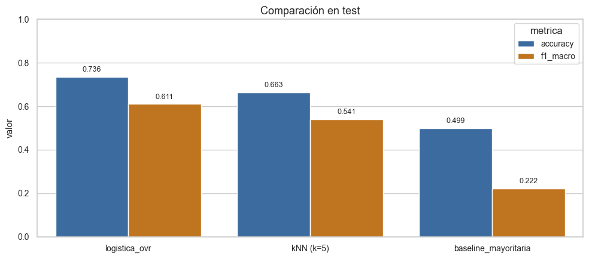
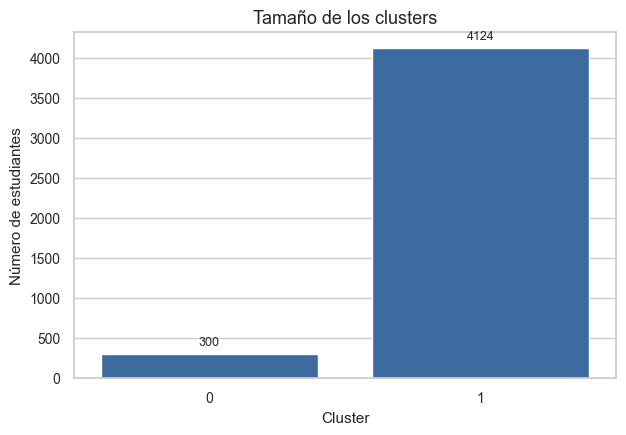

# Predicción del abandono y rendimiento académico

**Algoritmos de aprendizaje automático implementados desde cero y aplicados a 4.424 estudiantes de educación superior.**

Proyecto de Aprendizaje Automático de **Enrique Capella Magallón**, estudiante de Ingeniería Matemática e Inteligencia Artificial en **ICAI · Universidad Pontificia Comillas**.

El trabajo estudia qué información ayuda a anticipar la trayectoria académica. Compara una predicción inicial, sin resultados de los semestres, con otra que incorpora el primer semestre. Resuelve tres tareas: clasificar la situación académica, estimar la nota media del segundo semestre y explorar perfiles de estudiantes.

**Python · NumPy · pandas · scikit-learn · Matplotlib · Seaborn · Jupyter**

## Qué aporta el proyecto

- **Implementaciones propias:** kNN con distancia de Minkowski; regresión logística binaria y multiclase one-vs-rest con regularización; regresión lineal por pseudoinversa y descenso por gradiente.
- **Evaluación:** modelos de referencia, validación cruzada con preprocesado ajustado dentro de cada fold y comparación de escenarios según disponibilidad de información académica.
- **Análisis del dato:** valores faltantes, categorías especiales, notas cero, distribución de clases y posibles valores atípicos.
- **Aprendizaje no supervisado:** PCA y KMeans de scikit-learn, selección de k mediante silhouette y estabilidad entre semillas con ARI.

Las implementaciones propias parten del trabajo de prácticas de la asignatura. El preprocesado, los particionadores de validación, las métricas de clasificación, PCA y KMeans utilizan scikit-learn. La lógica que coordina la validación cruzada está implementada en `src/validacion_cruzada_propia.py`.

## Resultados de la versión actual

Las tablas proceden de la ejecución completa de los notebooks. En los modelos supervisados se reserva un 20 % para test y se utiliza validación cruzada de 5 folds sobre entrenamiento, con semilla 42. El escenario y el modelo principal se seleccionan con CV; la sensibilidad al tratamiento de faltantes también se evalúa en entrenamiento.

### Clasificación: abandono, matriculado o graduado

| modelo | accuracy | f1_macro |
| --- | --- | --- |
| logistica_ovr | 0.736 | 0.611 |
| kNN (k=5) | 0.663 | 0.541 |
| baseline_mayoritaria | 0.499 | 0.222 |

Modelo seleccionado por CV: **logistica_ovr**. F1 macro asigna el mismo peso a cada clase; accuracy resume los aciertos globales.



### Regresión: nota media del segundo semestre

| modelo | R2 | RMSE | MAE |
| --- | --- | --- | --- |
| baseline_media | -0.003 | 4.218 | 2.791 |
| lineal_least_squares | 0.626 | 2.575 | 1.541 |
| lineal_gradient_descent | 0.666 | 2.434 | 1.476 |

Modelo seleccionado por CV: **lineal_gradient_descent**. Las métricas se calculan solo para estudiantes con objetivo interpretable tras la regla de limpieza de notas cero. Un RMSE menor indica menos error; R² compara con una predicción constante basada en la media del conjunto evaluado.

### Perfiles de estudiantes

PCA y KMeans producen **2 grupos**, con silhouette de **0.341** en el ajuste final y ARI medio entre semillas de **1.000**. Son medidas internas de estructura y estabilidad; los grupos no equivalen a las clases de la situación académica.



Las tablas completas, incluidos los resultados de CV, están en [results/](results/).

## Explorar el trabajo

| Notebook | Contenido |
| --- | --- |
| [01 · Exploración](notebooks/01_eda.ipynb) | Calidad del dato, distribución de clases y decisiones de limpieza |
| [02 · Preprocesado](notebooks/02_preprocesado.ipynb) | Separación de tareas, tipos de variables y transformaciones |
| [03 · Clasificación](notebooks/03_clasificacion.ipynb) | kNN, logística OVR, CV, sensibilidad y evaluación por clase |
| [04 · Regresión](notebooks/04_regresion.ipynb) | Mínimos cuadrados, gradiente, errores y coeficientes |
| [05 · No supervisado](notebooks/05_no_supervisado.ipynb) | PCA, KMeans, silhouette, estabilidad y descripción de perfiles |

Los notebooks incluyen las salidas para poder consultarlos directamente en GitHub. La [memoria académica original](reports/Informe_academico_original.pdf) se conserva como documento de la entrega; [las diferencias con esta versión](reports/README.md) están documentadas.

## Reproducir

Entorno comprobado: **Python 3.13.14**, con versiones fijadas en [requirements.txt](requirements.txt). Los datos necesarios están incluidos.

```bash
git clone https://github.com/enrcap/student-academic-performance.git
cd student-academic-performance
python -m venv .venv
```

Activar el entorno en Windows PowerShell:

```powershell
.venv\Scripts\Activate.ps1
```

En macOS o Linux:

```bash
source .venv/bin/activate
```

Instalar las dependencias y abrir JupyterLab:

```bash
python -m pip install -r requirements.txt
python -m ipykernel install --user --name student-academic-performance --display-name "Student academic performance"
python -m jupyterlab
```

Seleccionar el kernel del entorno y ejecutar los notebooks del 01 al 05 con **Run All**. Cada notebook carga los datos por separado y puede ejecutarse desde la raíz o desde `notebooks/`.

Para ejecutarlos todos y guardar sus salidas desde terminal, dentro del entorno activado:

```bash
python scripts/run_notebooks.py --in-process
```

La ejecución usa IPython en un proceso independiente por notebook, sin abrir puertos de kernel. Reentrena los modelos y regenera las tablas de `results/`; puede tardar varios minutos. Se puede ejecutar uno solo añadiendo `--notebook 03_clasificacion.ipynb`.

Comprobaciones del código:

```bash
python -m unittest discover -s tests -v
```

## Datos

El CSV recibido en la asignatura es una versión con columnas y categorías en español de **Predict Students' Dropout and Academic Success**, de Realinho, Vieira Martins, Machado y Baptista (2021), UCI Machine Learning Repository. [DOI: 10.24432/C5MC89](https://doi.org/10.24432/C5MC89).

Se ha comprobado la correspondencia fila a fila con el original. La [documentación de datos](data/README.md) incluye procedencia, transformaciones y atribución; el dataset original se distribuye bajo **CC BY 4.0**.

## Limitaciones

- Se reutiliza una partición ya explorada en la entrega académica. La revisión separa selección y evaluación en el código, pero el test sigue siendo una evaluación retrospectiva; hace falta una cohorte nueva para validación externa.
- Excluir variables académicas futuras no certifica la fecha de registro de todos los estados administrativos. La disponibilidad temporal de esos datos requiere comprobación adicional.
- El tratamiento de una nota cero con cero evaluaciones como faltante es una hipótesis de limpieza. En regresión cambia la población sobre la que se calculan las métricas.
- El dataset procede de una institución concreta; no se ha validado su generalización a otras universidades. Las asociaciones no establecen causalidad y los clusters son descriptivos.

## Autoría y uso

**[Enrique Capella Magallón](https://github.com/enrcap)** · ICAI · Curso 2025/2026.

Proyecto académico de aprendizaje y portfolio. Se mantiene la indicación de uso académico de la entrega original; no se añade una licencia de software que amplíe sus permisos. La licencia y atribución del dataset se documentan por separado en `data/README.md`.
